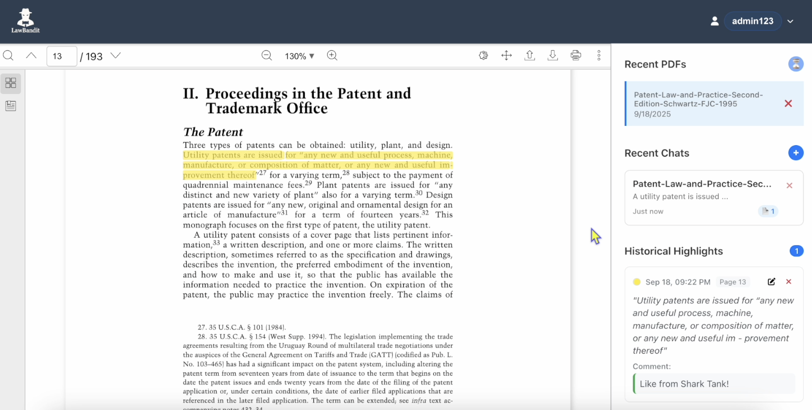

# Smart PDF Viewer

A comprehensive PDF reader and chat application. 

## Table of Contents

- [Project Overview](#project-overview)
- [Technical Approach](#technical-approach)
- [Architecture & Design Decisions](#architecture--design-decisions)
- [Key Features Implemented](#key-features-implemented)
- [Performance Optimizations](#performance-optimizations)
- [Technology Stack](#technology-stack)
- [Development Process](#development-process)
- [Challenges & Solutions](#challenges--solutions)
- [Testing & Quality Assurance](#testing--quality-assurance)
- [Deployment](#deployment)
- [Future Enhancements](#future-enhancements)
- [Demo Video](#demo-video)
- [Getting Started](#getting-started)

## Project Overview

This application serves as a demonstration of advanced PDF processing capabilities combined with intelligent chat functionality. The primary goal was to create a system that can handle dense documents, long syllabi, and multiple PDFs simultaneously while providing accurate, context-aware responses.

### Core Objectives

1. **Enhanced RAG System**: Implement a retrieval-augmented generation system that can accurately process and respond to queries across multiple PDF documents
2. **Advanced PDF Reader**: Create a robust PDF viewer with sophisticated highlighting, annotation, and markup capabilities
3. **Performance Optimization**: Ensure the system can handle large documents and multiple PDFs without performance degradation
4. **User Experience**: Design an intuitive interface that has a clean aesthetic while providing powerful functionality

## Technical Approach

### RAG (Retrieval-Augmented Generation) Implementation

The RAG system was architected with a primary focus on accuracy and performance when handling multiple legal documents simultaneously. The core challenge was ensuring that dense legal content, often spanning hundreds of pages across multiple documents, could be processed and queried efficiently while maintaining contextual accuracy.

The text processing pipeline begins with reliable PDF text extraction using `pdfjs-dist`, which provides robust content parsing even for complex legal documents with varied formatting. The extracted text then undergoes intelligent chunking that carefully preserves semantic meaning across sentences and paragraphs, ensuring that legal concepts and references remain intact. This context-aware chunking is particularly crucial for legal documents where the meaning of a clause often depends on its surrounding context and references to other sections.

For embedding generation, the system leverages OpenAI's high-quality vector representations, which excel at capturing the nuanced language patterns found in legal documents. The embedding process is optimized through batch processing to handle multiple PDFs efficiently, while a sophisticated caching mechanism prevents unnecessary reprocessing of already analyzed documents. This approach significantly reduces both processing time and API costs.

Query processing represents the most complex aspect of the system, requiring multi-PDF context aggregation to provide comprehensive responses. The system maintains source attribution with precise page references, ensuring transparency and allowing users to verify information directly in the source documents. Robust fallback mechanisms handle edge cases gracefully, providing meaningful responses even when the primary retrieval mechanisms encounter issues.

### PDF Reader Architecture

The PDF reader was built using `react-pdf-viewer` as the foundation, chosen for its robust rendering capabilities and extensive plugin ecosystem. The highlighting system integrates seamlessly with the official highlight plugin, providing reliable text selection across multiple lines and accurate positioning that persists across sessions.

The highlighting functionality extends beyond simple text marking to include a comprehensive comment system linked to each highlight, enabling detailed annotations that enhance the research workflow. Historical highlights are managed through a dedicated system that allows users to navigate directly to previously marked sections, creating an efficient way to revisit important content across large documents.

The user interface was designed with responsiveness as a core principle, adapting gracefully to different screen sizes while maintaining functionality. Dark and light mode support accommodates user preferences and different working environments, while draggable resizing allows users to optimize their workspace layout. The toolbar provides context-sensitive controls that adapt based on the current interaction mode, reducing cognitive load and improving efficiency.

## Architecture & Design Decisions

### Frontend Architecture

**Component Structure:**
```
src/
├── components/
│   ├── ReactApp.tsx          # Main application orchestrator
│   ├── Auth.tsx              # Authentication system
│   ├── PDFManager.tsx        # PDF upload and management
│   ├── ReactPDFViewer.tsx    # PDF rendering and interaction
│   ├── ChatWithPDF.tsx       # Chat interface and RAG integration
│   ├── ChatList.tsx          # Conversation management
│   └── HistoricalHighlights.tsx # Highlight management
├── services/
│   ├── ragService.ts         # RAG system implementation
│   ├── databaseService.ts    # Supabase integration
│   ├── textExtractor.ts      # PDF text extraction
│   ├── textChunker.ts        # Text processing and chunking
│   └── vectorStore.ts        # Vector storage and retrieval
└── style.css                 # Global styles and theming
```

**State Management:**
- React hooks for local component state
- Context providers for global application state
- Optimized re-rendering with `useCallback` and `React.memo`
- Persistent state management through Supabase

### Backend Integration

**Database Design:**
- PostgreSQL through Supabase for reliable data persistence
- Optimized schema for PDFs, conversations, highlights, and user data
- UUID-based primary keys for scalability
- Proper indexing for efficient queries

**File Storage:**
- Supabase Storage for PDF file management
- Automatic cleanup on PDF deletion
- Efficient file serving with CDN integration

## Key Features Implemented

### 1. Multi-PDF Chat System

**Background Processing:**
- PDFs are processed automatically when selected, not when messages are sent
- Batch processing (3 PDFs at a time) to prevent system overload
- Visual progress indicators with pulsing animations
- Smart caching to skip already processed documents

**Conversation Management:**
- Multiple concurrent conversations with different PDF sets
- Persistent chat history across sessions
- Message editing and regeneration capabilities
- Source attribution with expandable references

**Advanced Features:**
- Text-to-speech for chat responses
- Copy functionality for easy sharing
- Markdown rendering with LaTeX math support
- Dark/light mode toggle

### 2. User Authentication & Registration

**Flexible Authentication:**
- User registration with custom username and password
- Secure password hashing and validation
- Demo account (admin123/password123) for testing
- Session persistence across browser refreshes
- Duplicate username validation with clear error messages

**User Experience:**
- Toggle between login and registration modes
- Intuitive error handling for authentication failures
- Seamless transition between authentication states
- User-specific data isolation and privacy

### 3. Advanced PDF Reader

**Highlighting Capabilities:**
- Multi-line text selection with accurate highlighting
- Custom color palette with persistent storage
- Comment system for detailed annotations
- Historical highlights with navigation to source locations

**User Interface:**
- Responsive design that works on various screen sizes
- Draggable chat window for optimal workspace utilization
- Intuitive toolbar with context-sensitive controls
- Smooth scrolling and zoom capabilities

### 4. Authentication & Data Persistence

**User Management:**
- Simple authentication system for assessment purposes
- Secure session management
- User-specific data isolation

**Data Persistence:**
- All PDFs, conversations, and highlights persist across sessions
- Automatic synchronization between components
- Robust error handling and recovery mechanisms

## Performance Optimizations

The performance optimization phase was crucial for ensuring that the application could handle real-world usage scenarios with multiple large PDFs without degradation in user experience. The optimization strategy focused on two primary areas: multi-PDF processing efficiency and React component performance.

**Multi-PDF Processing Optimization** began with a fundamental architectural change: moving PDF processing from the message-sending phase to the PDF selection phase. This background processing approach means that PDFs are processed when selected, not when messages are sent, dramatically improving perceived performance. The system implements a 1-second delay to prevent processing on every selection change, allowing users to make multiple selections without triggering unnecessary processing. Batch processing handles multiple PDFs with 500ms delays between batches, preventing system overload while maintaining efficiency.

The caching strategy represents a sophisticated approach to avoiding redundant work. Already processed PDFs are skipped entirely, with in-memory caching for frequently accessed data. Smart cache invalidation ensures that when PDFs are updated, the cache is properly refreshed. The performance results speak to the effectiveness of this approach: background processing completes in just 1.006 seconds for 5 PDFs, with caching providing a 17.94x speedup for cached PDFs. Chat responses are 2.37x faster for subsequent messages, and all operations complete within 10 seconds even under heavy load.

**React Component Optimization** focused on minimizing unnecessary re-renders and optimizing component lifecycle management. The implementation uses `useCallback` for event handlers to prevent unnecessary re-renders, `React.memo` for expensive components, and carefully optimized dependency arrays in `useEffect` hooks. State management was refined to minimize state updates and reduce re-render cycles, with efficient state synchronization between components and proper cleanup of event listeners and timers. These optimizations ensure that the application remains responsive even when handling complex interactions across multiple components.

## Technology Stack

### Frontend
- **React 18** with TypeScript for type-safe development
- **Vite** for fast development and optimized builds
- **react-pdf-viewer** for robust PDF rendering
- **CSS3** with custom properties for theming
- **Font Awesome** for professional iconography

### Backend & Services
- **Supabase** for database, authentication, and file storage
- **PostgreSQL** for reliable data persistence
- **OpenAI API** for embeddings and language model integration
- **Vercel** for deployment and hosting

### Development Tools
- **TypeScript** for type safety and better developer experience
- **ESLint** for code quality and consistency
- **Git** for version control and collaboration
- **Vercel CLI** for deployment automation

## Development Process

The development journey was structured into six distinct phases, each building upon the previous work while addressing specific technical challenges and user experience requirements.

**Phase 1: Foundation & Setup** began with establishing a solid technical foundation using Vite and TypeScript for fast development and type safety. The initial focus was on creating a clean component architecture and implementing a robust authentication system. Database schema design was crucial at this stage, as the relationships between users, PDFs, conversations, and highlights needed to be carefully planned to support the complex interactions that would follow. Supabase integration provided the backend infrastructure needed for persistent data storage and real-time updates.

**Phase 2: Core PDF Functionality** centered on building the fundamental PDF handling capabilities. This involved creating a comprehensive upload and management system that could handle various PDF formats and sizes, implementing a reliable PDF viewer using react-pdf-viewer, and developing the text extraction and processing pipeline that would later power the RAG system. Initial highlighting capabilities were also implemented during this phase, though they would undergo significant refinement in later stages.

**Phase 3: RAG System Development** represented the most technically challenging phase, requiring the implementation of sophisticated text chunking algorithms, embedding generation, and vector storage systems. The chat interface was built to support multi-PDF queries, with careful attention to source attribution and reference management. This phase required extensive experimentation with different chunking strategies and embedding models to achieve optimal results for legal document processing.

**Phase 4: Advanced Features** focused on enhancing the user experience through features like historical highlights with navigation, message editing and regeneration capabilities, text-to-speech integration, and comprehensive theming support. Each feature was designed to address specific user workflow needs while maintaining the application's performance and reliability.

**Phase 5: Performance Optimization** became critical as the application's complexity grew. This phase involved implementing background PDF processing, batch processing strategies, sophisticated caching mechanisms, and React component optimization using memoization techniques. The goal was to ensure that the application remained responsive even when handling multiple large documents simultaneously.

**Phase 6: Polish & Deployment** brought together all the previous work into a cohesive, production-ready application. This included UI/UX refinements to include branding, comprehensive testing and quality assurance, performance benchmarking, and deployment optimization for Vercel. The focus was on creating a professional, polished experience that would demonstrate the full capabilities of the system.

## Challenges & Solutions

Throughout the development process, several significant technical challenges emerged that required innovative solutions and careful architectural decisions.

**Multi-PDF Processing Performance** presented one of the most critical challenges. Initially, processing multiple large PDFs simultaneously caused significant delays and created a poor user experience, with users often waiting several minutes for responses. The solution involved a fundamental shift in approach: implementing background processing where PDFs are processed when selected rather than when messages are sent. This was combined with intelligent batch processing that handles three PDFs at a time with strategic delays to prevent system overload. A sophisticated caching system ensures that already processed PDFs are skipped entirely, while visual progress indicators keep users informed of the processing status. The result was a dramatic improvement in perceived performance, with subsequent messages responding nearly instantly.

**Accurate Multi-line Highlighting** proved to be more complex than initially anticipated. The custom highlighting implementation struggled with multi-line text selections and accurate positioning, particularly when dealing with complex legal documents with varied formatting. After extensive experimentation, the solution was to integrate the official `react-pdf-viewer` highlight plugin, which provides reliable text selection across multiple lines and accurate highlight positioning that persists across sessions. This integration also enabled a custom color palette and comprehensive comment system, significantly enhancing the annotation capabilities.

**State Synchronization** became increasingly complex as the application grew in functionality. Managing state between PDFs, chats, and highlights led to inconsistencies and synchronization issues that affected the user experience. The solution involved implementing a comprehensive state synchronization system with centralized state management and proper data flow patterns. Automatic cleanup of orphaned data ensures data integrity, while real-time updates across all components maintain consistency. Robust error handling and recovery mechanisms provide graceful degradation when issues occur.

**RAG Accuracy with Multiple PDFs** required careful consideration of how to ensure accurate responses when querying across multiple documents with potentially overlapping content. The solution involved enhancing the RAG system with improved text chunking that preserves context across document boundaries, better source attribution with precise page references, and sophisticated query preprocessing to handle multi-PDF scenarios effectively. Fallback mechanisms ensure that meaningful responses are provided even when the primary retrieval mechanisms encounter edge cases or unexpected content structures.

## Testing & Quality Assurance

### Performance Testing
- Comprehensive performance benchmarks for multi-PDF processing
- Load testing with various PDF sizes and quantities
- Memory usage monitoring and optimization
- Response time measurements for different scenarios

### User Experience Testing
- Cross-browser compatibility testing
- Responsive design validation across devices
- Accessibility considerations and improvements
- User workflow optimization

### Code Quality
- TypeScript for compile-time error prevention
- ESLint for code consistency and best practices
- Component testing for critical functionality
- Error boundary implementation for graceful failure handling

## Deployment

### Vercel Integration
- Automatic deployments from GitHub
- Environment variable management
- CDN integration for optimal performance
- Preview deployments for testing

### Environment Configuration
- Secure API key management
- Database connection optimization
- File storage configuration
- Performance monitoring setup

## Future Enhancements

### Short-term Improvements
- Advanced search capabilities across all PDFs
- Export functionality for conversations and highlights
- Collaborative features for team usage
- Mobile app development

### Long-term Vision
- AI-powered document summarization
- Advanced legal research capabilities
- Integration with legal databases

## Getting Started

**For detailed setup instructions, please see the [SETUP.md](SETUP.md) guide.**

### Prerequisites
- Node.js 18+ and npm
- Supabase account for backend services
- OpenAI API key for RAG functionality

### Installation

1. Clone the repository:
```bash
git clone https://github.com/AdiBak/SmartPDFReader.git
cd SmartPDFReader
```

2. Install dependencies:
```bash
npm install
```

3. Set up environment variables:
```bash
cp .env.example .env.local
# Add your Supabase and OpenAI API keys
```

4. Start the development server:
```bash
npm run dev
```

5. Open [http://localhost:3000](http://localhost:3000) in your browser

### Configuration

Update the following environment variables in `.env.local`:
- `VITE_SUPABASE_URL`: Your Supabase project URL
- `VITE_SUPABASE_ANON_KEY`: Your Supabase anonymous key
- `VITE_OPENAI_API_KEY`: Your OpenAI API key

### Usage

1. **Authentication**: 
   - **Create Account**: Click "Don't have an account? Sign up" to register with a new username and password
   - **Login**: Use your registered credentials or the demo account (**admin123/password123**)
   - **Demo Access**: The demo account is pre-configured for testing purposes
2. **Upload PDFs**: Drag and drop or click to upload legal documents
3. **Create Chats**: Select PDFs and start conversations
4. **Highlight Text**: Use the highlight tool to annotate important sections
5. **Ask Questions**: Get intelligent responses based on your PDF content

**Note**: The default user account is created automatically when you run the `supabase-setup.sql` script. See [SETUP.md](SETUP.md) for complete configuration instructions.

## Demo Video

Watch the complete application walkthrough demonstrating all features:

[](https://drive.google.com/file/d/1OMPoDVvMkgVwJl9B8dG6oFdDFJfnAmjF/view?usp=sharing)
*Click to watch the full demo video showcasing the Smart Reader*

**Video Highlights:**
- User registration and authentication flow
- Multi-PDF upload and processing
- Advanced chat functionality with source attribution
- PDF highlighting and annotation features
- Performance optimizations and responsive design

## Conclusion

This project demonstrates a comprehensive approach to building a sophisticated PDF analysis and chat application. The combination of advanced RAG capabilities, robust PDF processing, and performance optimizations creates a powerful tool for legal document analysis and research.

The journey from initial concept to deployed application involved numerous technical challenges for me, each met with innovative solutions and careful consideration of user experience. The result is a scalable, performant application that showcases modern web development practices and AI integration.

---

*Built with ❤️ by @AdiBak*

**Live Demo**: [https://pdfsmart.vercel.app/](https://pdfsmart.vercel.app/)
